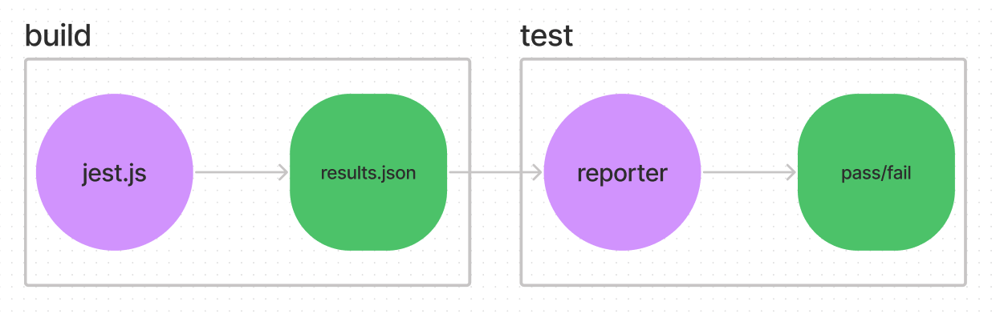

# Experimental Bazel rules to run Jest as a worker

A big roadblock we've hit while trying to run our Jest tests with Bazel is the high overhead of spawning a new Jest process (10s of seconds).

From what I can see, most of this startup time can be attributed to building the "HasteMap". Specifically, Jest lists all of the files in the repository using the `find` command. In a large repo this can take an incredible amount of time.

This overhead can be avoided if you specify a custom HasteMap implementation that does no work. This is fine if you know what tests you want to run ahead of time, as we do with Bazel.

However, even if the HasteMap can be built quickly, we still have a long tail of slow-ish things that kill the performance of Jest inside bazel. For this reason, I wanted to explore running Jest as a "persistent worker", which would mean that we'd pay the startup overhead a handful of times rather than once per test suite.

## Implementation



As far as I can tell, Bazel has no support for running test binaries as persistent workers, and can only run processes spawned using `ctx.actions.run` as persistent workers. This means that the persistent worker optimisation is only available when *building*, and not available during testing.

To get around this, this implementation first runs a hacked-together Jest CLI as a *build* step, where the output is a `results.json` file. This build will succeed regardless of whether or not the tests passed. The actual test depends on that results file, and simply prints out any failure messages, and fails if the tests failed.

The `jest_test` macro looks like this:

```py
def jest_test(name, srcs):
    _create_jest_test_results(
        name = name + "_results",
        srcs = srcs,
        results = "results.json"
    )
    nodejs_test(
        name = name,
        entry_point = "//tools/jest:reporter.js",
        templated_args = ["$(rootpath :results.json)"],
        data = [":results.json"],
        size = "small"
    )
```

Since the tests themselves are not run as tests from Bazel's perspective, you miss out on a lot of the niceties that Bazel gives you. Timeouts and re-running flaky tests, for example.
